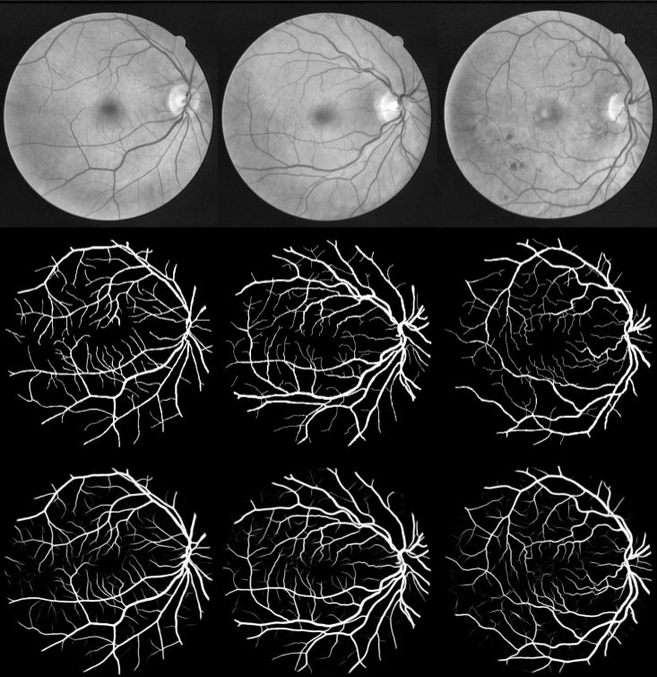
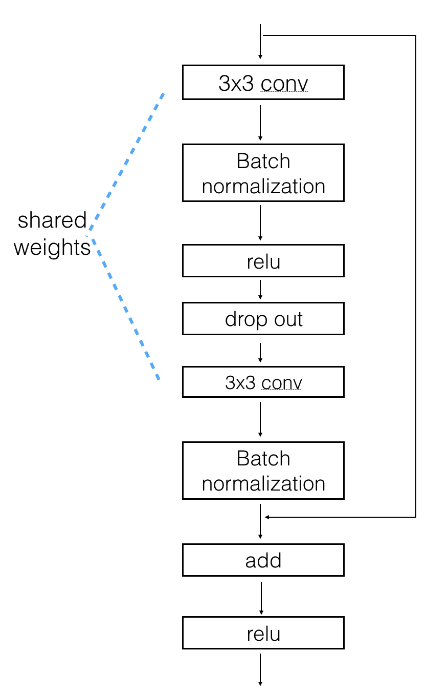

# LadderNet 
* [Link to my homepage](https://juntangzhuang.com)
* This is repository for my paper [LadderNet: Multi-path networks based on U-Net for medical image segmentation](https://arxiv.org/abs/1810.07810), and avhieves the best result on DRIVE and CHASE_DB1 dataset up to the date of submission<br>
* This implementation is based on [orobix implementation](https://github.com/orobix/retina-unet). Main difference is the structure of the model.

# Citation
**LadderNet: Multi-path networks based on U-Net for medical image segmentation**[[arxiv]](https://arxiv.org/abs/1810.07810)
```
@article{zhuang2018laddernet,
  title={LadderNet: Multi-path networks based on U-Net for medical image segmentation},
  author={Zhuang, Juntang},
  journal={arXiv preprint arXiv:1810.07810},
  year={2018}
}
```
# Requirement
* Python3 
* PyTorch 0.4
* configparser

# How to run
* run ```python prepare_datasets_DRIVE.py``` to generate hdf5 file of training data
* run ```cd src```
* run ```python retinaNN_training.py``` to train
* run ```python retinaNN_predict.py``` to test

# Parameter defination
* parameters (path, patch size, et al.) are defined in <b>"configuration.txt"</b>
* training parameters are defined in src/retinaNN_training.py line 49 t 84 with notes <b>"=====Define parameters here =========" </b>

# Pretrained weights
* pretrained weights are stored in <b>"src/checkpoint"</b>
* results are stored in <b>"test/"</b>

# Results
The results reported in the `./test` folder are referred to the trained model which reported the minimum validation loss. The `./test` folder includes:
- Model:
  - `test_model.png` schematic representation of the neural network
  - `test_architecture.json` description of the model in json format
  - `test_best_weights.h5` weights of the model which reported the minimum validation loss, as HDF5 file
  - `test_last_weights.h5`  weights of the model at last epoch (150th), as HDF5 file
  - `test_configuration.txt` configuration of the parameters of the experiment
- Experiment results:
  - `performances.txt` summary of the test results, including the confusion matrix
  - `Precision_recall.png` the precision-recall plot and the corresponding Area Under the Curve (AUC)
  - `ROC.png` the Receiver Operating Characteristic (ROC) curve and the corresponding AUC
  - `all_*.png` the 20 images of the pre-processed originals, ground truth and predictions relative to the DRIVE testing dataset
  - `sample_input_*.png` sample of 40 patches of the pre-processed original training images and the corresponding ground truth
  - `test_Original_GroundTruth_Prediction*.png` from top to bottom, the original pre-processed image, the ground truth and the prediction. In the predicted image, each pixel shows the vessel predicted probability, no threshold is applied.

The following table compares this method to other recent techniques, which have published their performance in terms of Area Under the ROC curve (AUC ROC) on the DRIVE dataset.

| Method                  | AUC ROC on DRIVE |
| ----------------------- |:----------------:|
| Soares et al [1]        | .9614            |
| Azzopardi et al. [2]    | .9614            |
| Osareh et al  [3]       | .9650            |
| Roychowdhury et al. [4] | .9670            |
| Fraz et al.  [5]        | .9747            |
| Qiaoliang et al. [6]    | .9738            |
| Melinscak et al. [7]    | .9749            |
| Liskowski et al.^ [8]   | .9790            |
| orobix                  | .9790            |
| **this method**         | **.9794**        |



# Method
* Laddernet can be viewed as a chain of two U-Nets to generate multiple paths of FCN for information flow.

* use shared weights between two conv layers within a residual block.

